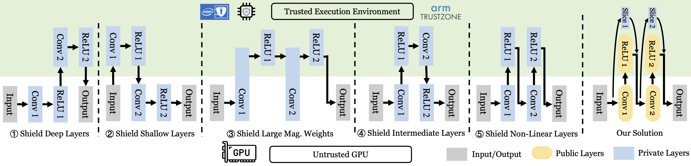

<!-- # A TEE-based Confidential Heterogeneous Deployment Framework for DNN Models -->

<!-- <div align="left"> -->
<h1>TAOISM: A <ins>T</ins>EE-b<ins>a</ins>sed C<ins>o</ins>nfident<ins>i</ins>al Heterogeneou<ins>s</ins> Deploy<ins>m</ins>ent Framework for DNN Models</h1>
<div align="center">
  <a href="https://opensource.org/license/mit/">
    
  </a>
  <a href="https://pytorch.org/">
    =v1.7.0-EE4C2C.svg?style=flat-square">
  </a>
  <a href="hhttps://opensource.org/license/mit/">
    2.6-green">
  </a>
</div>
<!-- <div align="left"> -->


<div align="center">

</div>


TAOISM is a <ins>T</ins>EE-b<ins>A</ins>sed c<ins>O</ins>nfident<ins>I</ins>al heterogeneou<ins>S</ins> deploy<ins>M</ins>ent framework for DNN Models. TAOISM is light-weight, flexible and compatible to PyTorch models. TAOISM can put some privacy-related and critical layers of a DNN model into SGX enclaves, and the rest of the model is executed on GPU. TAOISM is designed to evaluate the inference speed of various TEE-Shielded DNN Partition (TSDP) strategies. 


<center>
    
</center>
<p align="center">
    <em>Demonstration of six TSDP strategies.</em>
    <br>
</p>


For more detail of the framework and TSDP strategies, please refer to our S&P'24 paper:

[*No Privacy Left Outside: On the (In-)Security of TEE-Shielded DNN Partition for On-Device ML*](https://arxiv.org/abs/2310.07152) </br>
**Ziqi Zhang, Chen Gong, Yifeng Cai, Yuanyuan Yuan, Bingyan Liu, Ding Li, Yao Guo, Xiangqun Chen** </br>


If you found this code helpful for your research, please cite our paper:

```
@article{zhang2023no,
  title={No Privacy Left Outside: On the (In-) Security of TEE-Shielded DNN Partition for On-Device ML},
  author={Zhang, Ziqi and Gong, Chen and Cai, Yifeng and Yuan, Yuanyuan and Liu, Bingyan and Li, Ding and Guo, Yao and Chen, Xiangqun},
  journal={arXiv preprint arXiv:2310.07152},
  year={2023}
}

@inproceedings{zhang2022teeslice,
  title={TEESlice: Slicing DNN Models for Secure and Efficient Deployment},
  author={Zhang, Ziqi and Ng, Lucien KL and Liu, Bingyan and Cai, Yifeng and Li, Ding and Guo, Yao and Chen, Xiangqun},
  booktitle={Proceedings of the 2nd ACM International Workshop on AI and Software Testing/Analysis},
  pages={1--8},
  year={2022}
}
```


- [1. How to Install](#1-how-to-install)
- [2. How to run](#2-how-to-run)
- [4. Customize Your Model](#4-customize-your-model)
- [5. Code Structure](#5-code-structure)
- [6. Disclaimer](#6-disclaimer)
- [7. Acknowledgement](#7-acknowledgement)


##  1. <a name='HowtoInstall'></a>How to Install

1. Install Intel's [linux-sgx](https://github.com/intel/linux-sgx) and [linux-sgx-driver](https://github.com/intel/linux-sgx-driver).
    We tested our code on SGX SDK 2.15 To test if your hardware supports SGX, you can use this [repo](https://github.com/ayeks/SGX-hardware). To check if SGX SDK is correctly installed, you can check if `/dev/isgx` exists by running `ls /dev/isgx`. You can also run the sample code in SGX SDK to test if SGX is correctly installed.

    
1. Install PyTorch with Python3. You may install it using [Anaconda](https://www.anaconda.com/)

        conda create -n taoism python=3.7
        conda install pytorch==1.7.0 torchvision==0.8.0 torchaudio==0.7.0 cudatoolkit=11.0 -c pytorch

        
2. Make the C++ part of this repo

        make

NOTE: Currently the compilation's `SGX_MODE` is set to `HW`, which means the code can only run on a machine with SGX hardware. If you want to run the code on a machine without SGX hardware, you can compile in the simulation mode by changing the `SGX_MODE` to `SIM` in the Makefile. 


##  2. <a name='Howtorun'></a>How to run
1. Source your Intel SGK SDK environment. For example

        source /opt/intel/sgxsdk/environment

2. We provide two scripts (in `teeslice/scripts`) as a demonstration of our framework, you should run the scripts from the **root** directory of this project. (Do not enter the `teeslice` nor `teeslice/scripts` directories.)

- `teeslice/scripts/run_resnet_baseline.sh` can run a ResNet-18 model in three modes (GPU mode, CPU mode, and Enclave mode)
- `teeslice/scripts/run_teeslice.sh` runs three models trained from TEESlice on CIFAR100 dataset.


##  4. <a name='CustomizeYourModel'></a>Customize Your Model

We implement basic layers for CNN models. You can use these layers to build your own model and customize how to deployment your model. You can put some layers into SGX and the rest of the model to GPU. You can refer to `teeslice/sgx_resnet_cifar.py` and `teeslice/sgx_resnet_cifar_teeslice.py` for an example.


For each layer, you can use `EnclaveMode` parameter at initialization to specify how to deploy this layer. 
| EnclaveMode | Description |
| --- | --- |
| EnclaveMode.GPU | Run the layer on GPU |
| EnclaveMode.ENCLAVE | Run the layer in SGX |
| EnclaveMode.AUTO | Run the layer in SGX if the input tensor is in SGX, otherwise run on GPU |


NOTE: If you want to construct a network of other architectures, you may need to change the memory chunk size in the enclave. Due to the memory limitation of SGX, currently the memory in the SGX is managed in a chunk-based manner. The chunk size is defined in `/Include/common_with_enclaves.h` by `STORE_CHUNK_ELEM` and `WORK_CHUNK_ELEM` (Currently they are the same). For each layer, the framework loads one chunk in the memory and perform the operation on the chunk. 


For ResNet, if your input image size is 224x224, the chunk size should be set to 9408. If your input is 32x32, the chunk size should be set to 4704. The criterion to set the chunk size is that it should compatible with the tensor size for each layer during matrix multiplication. For linear layer, the chunk size should be divisible by input channels. For convolution layer, because the current implementation is based on im2col, the chunk size should be divisible $kernel\_size * kernel\_size$


##  5. <a name='CodeStructure'></a>Code Structure

We summarize the code structure and the functionality of major files/directories to help you understand and reuse the code.

```
.
|-- App                             Source code for the untrusted (application) side of the program
|   |-- bin                         Compiled intermediate binary files
|   |   |-- enclave_bridge.so       Compiled dynamic library for python lib
|   |   `-- ...
|   |-- aes_stream_common.cpp
|   |-- common_utils.cpp
|   |-- crypto_common.cpp
|   |-- enclave_bridge.cpp          Bridge functions for Python interface
|   |-- Enclave_u.c                 Generated by SGX SDK following Enclave/Enclave.edl
|   |-- Enclave_u.h                 Generated by SGX SDK following Enclave/Enclave.edl
|   |-- randpool_common.cpp
|   `-- sgxaes_common.cpp
|-- conv2d_extension                Conv2d extention
|   |-- conv2d_backward.cpp
|   `-- setup.py
|-- data                            Cifar10 dataset file
|   |-- cifar-10-batches-py
|   `-- cifar-10-python.tar.gz
|-- Enclave                         Source code for the trusted (enclave) side of the program
|   |-- bin                         Compiled intermediate binary files
|   |   |-- Enclave.o
|   |   `-- ...
|   |-- Enclave.config.xml
|   |-- Enclave.cpp
|   |-- Enclave.edl                 Define Ecalls
|   |-- Enclave.h
|   |-- Enclave.lds
|   |-- Enclave_private.pem
|   |-- Enclave_t.c                 Generated by SGX SDK following Enclave/Enclave.edl
|   |-- Enclave_t.h                 Generated by SGX SDK following Enclave/Enclave.edl
|   `-- sgxdnn.cpp                  Declare ecalls 
|-- Include                         Header files for the trusted side, needed by Enclave/ and SGXDNN/
|   |-- eigen                       Eigen library
|   |-- eigen3_sgx                  Eigen library
|   |-- aes_stream_common.hpp
|   |-- sgxdnn_common.hpp
|   `-- ...
|-- lib
|-- python                          Python files
|   |-- layers                      Python implementation of each layer
|   |   |-- batch_norm_2d.py        Perform BN in SGX
|   |   |-- relu.py                 Perform ReLU in SGX
|   |   |-- sgx_conv_base.py        Perform convolution in SGX
|   |   |-- sgx_linear_base.py      Perform linear in SGX
|   |   `-- ...
|   |-- test                        Test files for each layer
|   |   |-- connect_c.py            Test basic functionalities and interface between Enclave and App
|   |   |-- test_bn.py
|   |   |-- test_conv.py
|   |   |-- test_maxpool.py
|   |   `-- test_relu.py
|   |-- utils
|   |-- common_net.py
|   |-- common_torch.py
|   |-- enclave_interfaces.py       Interface of bridge functions between the untrusted (application) side and python
|   |-- sgx_net.py                  Build the whole network using a list of layers
|   |-- tensor_loader.py            Tensor manager in python
|   `-- ...
|-- SGXDNN                          DNN part in the trusted (enclave) side
|   |-- bin_sgx                     Compiled intermediate binary files
|   |   |-- layers
|   |   |-- aes-stream.o
|   |   `-- ...
|   |-- layers                      C++ implementation for each layer in
|   |   |-- batchnorm.cpp
|   |   |-- batchnorm.hpp
|   |   |-- conv.cpp
|   |   |-- conv.hpp
|   |   |-- linear.cpp
|   |   |-- linear.hpp
|   |   |-- maxpool.cpp
|   |   `-- maxpool.hpp
|   |-- aes-stream.cpp
|   |-- aes-stream.hpp
|   |-- chunk_manager.cpp           Manage memory chunks in the enclave
|   |-- chunk_manager.hpp
|   |-- Crypto.cpp
|   |-- Crypto.h
|   |-- randpool.hpp
|   |-- secret_tensor.cpp           Tensor management in the enclave
|   |-- secret_tensor.hpp
|   |-- sgxaes_asm.S
|   |-- sgxaes.cpp
|   |-- sgxaes.h
|   |-- sgxdnn_main.cpp             Main file in the enclave
|   |-- sgxdnn_main.hpp
|   |-- stochastic.cpp
|   |-- stochastic.hpp
|   |-- utils.cpp
|   |-- utils.hpp
|   |-- xoshiro.cpp
|   `-- xoshiro.hpp
|-- teeslice                        Code for TEESlice
|   |-- cifar10val                  Trained model checkpoints on CIFAR dataset
|   |   |-- cifar100-resnet18
|   |   |-- cifar100-resnet50
|   |   |-- iterative-teeslice-[cifar100-resnet18]
|   |   `-- iterative-teeslice-[cifar100-resnet50]
|   |-- scripts                     Scripts
|   |   |-- run_resnet_baseline.sh
|   |   `-- run_teeslice.sh
|   |-- eval_sgx_teeslice.py
|   |-- GUIDE.md
|   |-- resnet18_enclave_cpu_time.py
|   |-- resnet_cifar.py             ResNet for CIFAR, input image 32x32
|   |-- resnet.py                   ResNet implemntation from Pytorch, input image 224x224
|   |-- sgx_resnet_cifar.py         Put all ResNet layers in SGX
|   |-- sgx_resnet_cifar_teeslice.py    Put the private slices of TEESlice's ResNet in SGX and put the backbone on GPU 
|   |-- sgx_resnet.py               Put all CIFAR ResNet layers in SGX
|   |-- student_resnet_cifar.py     TEESLice's ResNet with private slices
|   `-- utils.py
|-- enclave.signed.so
|-- enclave.so                      Dynamic library of enclave code
|-- goten_app                       Compiled application
|-- LICENSE
|-- logfile.log
|-- Makefile                        Makefile to compile the C/C++ part
|-- README.md
`-- ...


```

##  6. <a name='Disclaimer'></a>Disclaimer
DO NOT USE THIS SOFTWARE TO SECURE ANY REAL-WORLD DATA OR COMPUTATION!

This software is a proof-of-concept meant for performance testing of the Goten framework ONLY. It is full of security vulnerabilities that facilitate testing, debugging and performance measurements. In any real-world deployment, these vulnerabilities can be easily exploited to leak all user inputs.

Some parts that have a negligble impact on performance but that are required for a real-world deployment are not currently implemented (e.g., setting up a secure communication channel with a remote client and producing verifiable attestations).

##  7. <a name='Acknowledgement'></a>Acknowledgement
The framework is based on the code of Goten (Lucien K. L. Ng, 2021) and Slalom (Tramer & Boneh, 2019).
